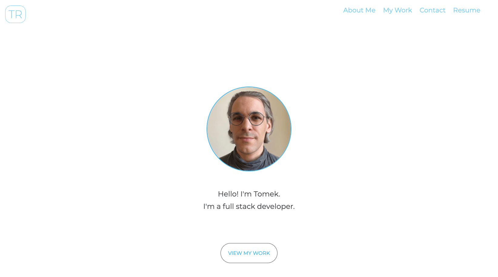
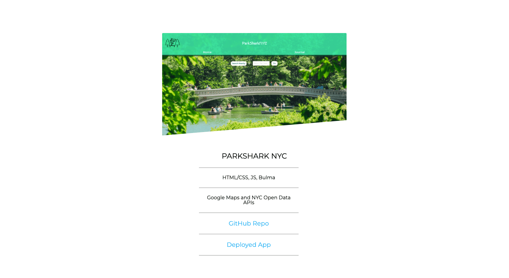

## My Portfolio

- [Description ](#description)
- [Installation and Usage](#installation-and-use)
- [License](#license)

# Description

This is my developer portfolio, which features my bio, contact information, resume, and overview/links to some of my projects.

This page has been deployed on Github as a work-in-progress, and can be viewed here: https://tomekregulski.github.io/portfolio/

# Installation and Use

Clone the repo and open the folder in the code editor of your choice.

# License

[MIT License](https://opensource.org/licenses/MIT)
